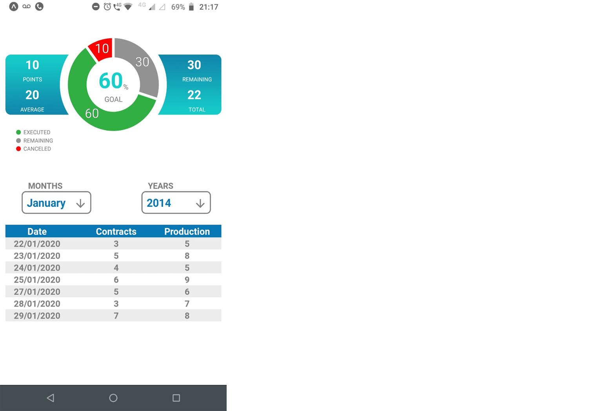

# customization-graphic-pie-chart

## About this Project

The idea of the App is:

_"Share knowledge in the form of podcasts, providing a simple way to learn"._

## Why?

This project is part of my personal portfolio, so, I'll be happy if you could provide me any feedback about the project, code, structure or anything that you can report that could make me a better developer!

Email-me: renato.colossus@gmail.com

Connect with me at [LinkedIn](https://www.linkedin.com/in/renato-santos-3486a724/).

Also, you can use this Project as you wish!
